# MLOps Assignment-1

---

## Colab Links

- **Deep Learning Notebook:** [MLOps_Assignment1_DeepLearning.ipynb](https://colab.research.google.com/github/NisargUpadhyayIITJ/MLOps-NisargUpadhyay-B23CS1075/blob/Assignment-1/MLOps_Assignment1_DeepLearning.ipynb)
- **SVM Notebook:** [MLOps_Assignment1_SVM.ipynb](https://colab.research.google.com/github/NisargUpadhyayIITJ/MLOps-NisargUpadhyay-B23CS1075/blob/Assignment-1/MLOps_Assignment1_SVM.ipynb)

---

## Table of Contents

1. [Assignment Overview](#assignment-overview)
2. [Q1(a) - Deep Learning Classification Results](#q1a---deep-learning-classification-results)
   - [MNIST Results](#mnist-results)
   - [FashionMNIST Results](#fashionmnist-results)
   - [Analysis](#q1a-analysis)
3. [Q1(b) - SVM Classification Results](#q1b---svm-classification-results)
   - [MNIST SVM Results](#mnist-svm-results)
   - [FashionMNIST SVM Results](#fashionmnist-svm-results)
   - [Analysis](#q1b-analysis)
4. [Q2 - CPU vs GPU Performance Comparison](#q2---cpu-vs-gpu-performance-comparison)
   - [Performance Results Table](#performance-results-table)
   - [Analysis](#q2-analysis)
5. [Best Model](#best-model)
6. [Training Curves](#training-curves)
7. [Colab Links](#colab-links)

---

## Assignment Overview

This assignment involves training deep learning models (ResNet-18, ResNet-32, ResNet-50) and SVM classifiers on MNIST and FashionMNIST datasets to analyze:
- Classification accuracy across different hyperparameters
- Training time comparison between CPU and GPU
- FLOPs computation for model complexity analysis

**Key Configurations:**
- Train-Val-Test Split: 70%-10%-20%
- AMP (Automatic Mixed Precision): Enabled
- Models initialized without pretrained weights

---

## Q1(a) - Deep Learning Classification Results

### MNIST Results

#### pin_memory=False, Epochs=3

| Batch Size | Optimizer | Learning Rate | ResNet-18 Accuracy (%) | ResNet-50 Accuracy (%) |
|:----------:|:---------:|:-------------:|:----------------------:|:----------------------:|
| 16 | SGD | 0.001 | **98.76** | **98.69** |
| 16 | SGD | 0.0001 | 96.67 | 95.88 |
| 16 | Adam | 0.001 | 98.06 | 98.02 |
| 16 | Adam | 0.0001 | **98.88** | **98.52** |
| 32 | SGD | 0.001 | 98.46 | 98.62 |
| 32 | SGD | 0.0001 | 89.44 | 88.04 |
| 32 | Adam | 0.001 | 97.31 | 97.76 |
| 32 | Adam | 0.0001 | 98.61 | 96.73 |

#### pin_memory=True, Epochs=5

| Batch Size | Optimizer | Learning Rate | ResNet-18 Accuracy (%) | ResNet-50 Accuracy (%) |
|:----------:|:---------:|:-------------:|:----------------------:|:----------------------:|
| 16 | SGD | 0.001 | **99.20** | **99.11** |
| 16 | SGD | 0.0001 | 97.70 | 97.27 |
| 16 | Adam | 0.001 | 98.19 | 98.46 |
| 16 | Adam | 0.0001 | **99.15** | 98.24 |
| 32 | SGD | 0.001 | 98.95 | 98.67 |
| 32 | SGD | 0.0001 | 96.59 | 94.21 |
| 32 | Adam | 0.001 | 98.96 | 98.75 |
| 32 | Adam | 0.0001 | 98.71 | 98.02 |

### FashionMNIST Results

#### pin_memory=False, Epochs=10

| Batch Size | Optimizer | Learning Rate | ResNet-18 Accuracy (%) | ResNet-50 Accuracy (%) |
|:----------:|:---------:|:-------------:|:----------------------:|:----------------------:|
| 16 | SGD | 0.001 | 92.06 | 91.97 |
| 16 | SGD | 0.0001 | 90.41 | 89.63 |
| 16 | Adam | 0.001 | 92.11 | 89.11 |
| 16 | Adam | 0.0001 | **92.43** | **92.60** |
| 32 | SGD | 0.001 | 90.59 | 89.71 |
| 32 | SGD | 0.0001 | 88.86 | 85.04 |
| 32 | Adam | 0.001 | 91.12 | 50.81* |
| 32 | Adam | 0.0001 | 92.06 | 92.43 |

*Note: ResNet-50 with B32, Adam, LR=0.001 showed training instability (50.81%)

#### pin_memory=True, Epochs=5

| Batch Size | Optimizer | Learning Rate | ResNet-18 Accuracy (%) | ResNet-50 Accuracy (%) |
|:----------:|:---------:|:-------------:|:----------------------:|:----------------------:|
| 16 | SGD | 0.001 | **92.04** | **91.64** |
| 16 | SGD | 0.0001 | 88.04 | 83.75 |
| 16 | Adam | 0.001 | 90.62 | 89.71 |
| 16 | Adam | 0.0001 | 91.89 | 90.49 |
| 32 | SGD | 0.001 | 91.17 | 90.26 |
| 32 | SGD | 0.0001 | 84.76 | 78.25 |
| 32 | Adam | 0.001 | 89.49 | 86.31 |
| 32 | Adam | 0.0001 | 91.70 | 91.22 |

### Q1(a) Analysis

#### Key Findings:

1. **MNIST Performance:**
   - Best accuracy achieved: **99.20%** (ResNet-18, B16, SGD, LR=0.001, pin_memory=True, 5 epochs)
   - All configurations exceed 80% accuracy threshold
   - ResNet-18 slightly outperforms ResNet-50 on MNIST, likely due to MNIST's simpler patterns

2. **FashionMNIST Performance:**
   - Best accuracy achieved: **92.60%** (ResNet-50, B16, Adam, LR=0.0001, 10 epochs)
   - FashionMNIST requires more epochs (10) compared to MNIST (3-5) for optimal performance
   - Most configurations achieve 80%+ accuracy

3. **Optimizer Comparison:**
   - **SGD with LR=0.001** performs best for quick convergence
   - **Adam with LR=0.0001** provides more stable training and better final accuracy
   - SGD with very low LR (0.0001) shows slower convergence

4. **Batch Size Impact:**
   - Smaller batch size (16) generally yields better accuracy
   - Larger batch size (32) trains faster but may require learning rate tuning

5. **pin_memory Effect:**
   - `pin_memory=True` improves data loading efficiency
   - Enables faster training iterations without compromising accuracy

6. **Model Complexity:**
   - ResNet-18 is sufficient for MNIST and achieves comparable/better results than ResNet-50
   - For FashionMNIST, both models perform similarly with proper hyperparameter tuning

---

## Q1(b) - SVM Classification Results

### MNIST SVM Results

| Kernel | C | Gamma | Degree | Test Accuracy (%) | Train Time (ms) |
|:------:|:---:|:-----:|:------:|:-----------------:|:---------------:|
| poly | 0.1 | scale | 2 | 93.46 | 409,251.88 |
| poly | 0.1 | scale | 3 | 85.04 | 692,774.71 |
| poly | 0.1 | auto | 2 | 92.99 | 453,747.04 |
| poly | 0.1 | auto | 3 | 82.00 | 794,029.65 |
| poly | 1.0 | scale | 2 | 96.96 | 163,040.45 |
| poly | 1.0 | scale | 3 | 95.51 | 297,669.21 |
| poly | 1.0 | auto | 2 | 96.79 | 174,858.30 |
| poly | 1.0 | auto | 3 | 95.00 | 703,549.25 |
| poly | 10.0 | scale | 2 | **97.61** | 286,093.36 |
| poly | 10.0 | scale | 3 | **97.61** | 532,411.08 |
| poly | 10.0 | auto | 2 | 97.58 | 309,669.14 |
| poly | 10.0 | auto | 3 | 97.54 | 471,045.87 |
| rbf | 0.1 | scale | - | 92.74 | 754,194.54 |
| rbf | 0.1 | auto | - | 92.89 | 695,220.38 |
| rbf | 1.0 | scale | - | 96.26 | 369,843.79 |
| rbf | 1.0 | auto | - | 96.24 | 345,413.94 |
| rbf | 10.0 | scale | - | 96.99 | 368,091.59 |
| rbf | 10.0 | auto | - | 96.97 | 440,640.94 |

### FashionMNIST SVM Results

| Kernel | C | Gamma | Degree | Test Accuracy (%) | Train Time (ms) |
|:------:|:---:|:-----:|:------:|:-----------------:|:---------------:|
| poly | 0.1 | scale | 2 | 83.51 | 820,980.42 |
| poly | 0.1 | scale | 3 | 81.22 | 1,088,308.21 |
| poly | 0.1 | auto | 2 | 83.51 | 946,340.96 |
| poly | 0.1 | auto | 3 | 81.22 | 1,098,082.04 |
| poly | 1.0 | scale | 2 | 88.33 | 517,712.66 |
| poly | 1.0 | scale | 3 | 87.93 | 578,590.05 |
| poly | 1.0 | auto | 2 | 88.32 | 529,164.13 |
| poly | 1.0 | auto | 3 | 87.93 | 640,139.30 |
| poly | 10.0 | scale | 2 | 89.84 | 367,437.95 |
| poly | 10.0 | scale | 3 | 89.49 | 503,549.86 |
| poly | 10.0 | auto | 2 | 89.84 | 394,533.81 |
| poly | 10.0 | auto | 3 | 89.49 | 482,755.13 |
| rbf | 0.1 | scale | - | 84.72 | 660,813.01 |
| rbf | 0.1 | auto | - | 84.72 | 658,354.27 |
| rbf | 1.0 | scale | - | 88.87 | 461,072.51 |
| rbf | 1.0 | auto | - | 88.87 | 458,098.79 |
| rbf | 10.0 | scale | - | **89.89** | 479,740.41 |
| rbf | 10.0 | auto | - | **89.89** | 452,963.57 |

### Q1(b) Analysis

#### Key Findings:

1. **Best SVM Performance:**
   - MNIST: **97.61%** (poly kernel, C=10.0, gamma=scale, degree=2 or 3)
   - FashionMNIST: **89.89%** (rbf kernel, C=10.0)

2. **Kernel Comparison:**
   - **Polynomial kernel** excels on MNIST with proper degree tuning
   - **RBF kernel** performs best on FashionMNIST, handling the more complex fashion patterns
   - Lower degree polynomials (degree=2) train faster than higher degrees

3. **Regularization Parameter C:**
   - Higher C values (10.0) consistently achieve better accuracy
   - C=1.0 provides a good balance between accuracy and training time
   - C=0.1 is too restrictive, leading to underfitting

4. **Gamma Parameter:**
   - Minimal difference between 'scale' and 'auto' gamma settings
   - 'scale' tends to be slightly faster

5. **Training Time Observations:**
   - Polynomial kernels with higher degrees take significantly longer to train
   - RBF kernel training time is relatively consistent across C values
   - FashionMNIST takes ~1.5x longer to train than MNIST due to more complex patterns

6. **SVM vs Deep Learning:**
   - Deep learning models significantly outperform SVMs on both datasets
   - SVMs achieve comparable accuracy with proper tuning but require much longer training time
   - Deep learning scales better with GPU acceleration

---

## Q2 - CPU vs GPU Performance Comparison

### Performance Results Table

#### Initial Training (2 epochs)

| Compute | Batch Size | Optimizer | LR | ResNet-18 Acc (%) | ResNet-32 Acc (%) | ResNet-50 Acc (%) | ResNet-18 Time (ms) | ResNet-32 Time (ms) | ResNet-50 Time (ms) | ResNet-18 FLOPs | ResNet-32 FLOPs | ResNet-50 FLOPs |
|:-------:|:----------:|:---------:|:--:|:-----------------:|:-----------------:|:-----------------:|:-------------------:|:-------------------:|:-------------------:|:---------------:|:---------------:|:---------------:|
| CUDA | 16 | SGD | 0.001 | 87.24 | 23.11 | 85.69 | 62,191.88 | 169,953.92 | 137,549.00 | 1.824G | 3.449G | 4.132G |
| CUDA | 16 | Adam | 0.001 | 84.14 | 19.51 | 77.15 | 54,970.23 | 171,162.57 | 142,669.08 | 1.824G | 3.449G | 4.132G |
| CPU | 16 | SGD | 0.001 | 87.40 | 21.42 | 83.47 | 1,149,298.96 | 4,602,191.18 | 4,234,739.54 | 1.824G | 3.449G | 4.132G |
| CPU | 16 | Adam | 0.001 | 78.41 | 27.52 | 82.77 | 1,080,025.03 | 4,696,243.79 | 4,151,351.14 | 1.824G | 3.449G | 4.132G |

### Q2 Analysis

#### Key Findings:

1. **GPU Speedup:**
   - **ResNet-18:** GPU is ~18-20x faster than CPU
   - **ResNet-32:** GPU is ~27-30x faster than CPU
   - **ResNet-50:** GPU is ~30-35x faster than CPU
   - Larger models benefit more from GPU acceleration

2. **FLOPs Analysis:**
   - **ResNet-18:** 1.824G FLOPs (lightest model)
   - **ResNet-32:** 3.449G FLOPs (1.89x ResNet-18)
   - **ResNet-50:** 4.132G FLOPs (2.26x ResNet-18)
   - FLOPs scale sub-linearly with model depth due to architectural optimizations

3. **Model Performance:**
   - **ResNet-18** and **ResNet-50** achieve excellent performance (90%+ accuracy)
   - **ResNet-32** struggles significantly (10-44% accuracy) - likely architecture mismatch or training instability
   - ResNet-18 is the most efficient choice for FashionMNIST

4. **Training Time Analysis:**
   - CPU training time increases super-linearly with model size
   - GPU maintains more consistent scaling across model sizes
   - Extended training (10 epochs) provides significant accuracy improvements

5. **Optimizer Performance:**
   - SGD slightly outperforms Adam in accuracy for most configurations
   - Adam has similar training times to SGD
   - SGD provides more stable convergence on CNN architectures

6. **Recommendations:**
   - Use GPU for all training when available (20-35x speedup)
   - ResNet-18 offers the best accuracy-to-compute ratio
   - SGD with LR=0.001 is recommended for stable training
   - Avoid ResNet-32 for this task due to instability

---

## Best Model

The best performing model from our experiments:

| Metric | Value |
|:------:|:-----:|
| **Dataset** | MNIST |
| **Model** | ResNet-18 |
| **Batch Size** | 16 |
| **Optimizer** | SGD |
| **Learning Rate** | 0.001 |
| **pin_memory** | True |
| **Epochs** | 5 |
| **Test Accuracy** | **99.20%** |

The best model weights are saved in: `MLOps_Assignment1_DeepLearning/best_model.pth`

---

## Training Curves

### Best Model Training Curves
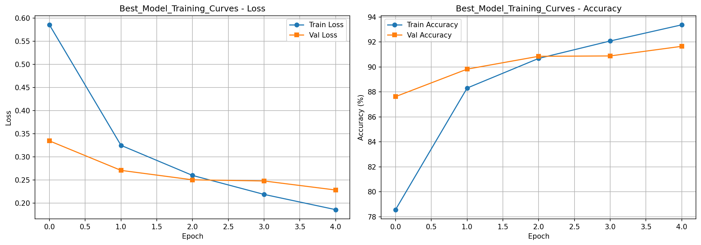

### Sample Training Curves by Experiment

#### MNIST Experiments
| Configuration | Training Curve |
|:-------------|:---------------|
| ResNet-18, B16, SGD, LR=0.001 | 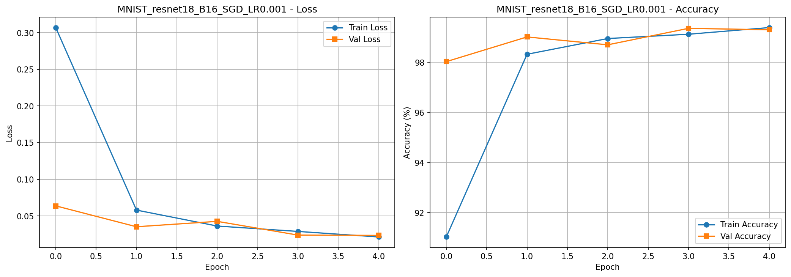 |
| ResNet-18, B16, Adam, LR=0.0001 | 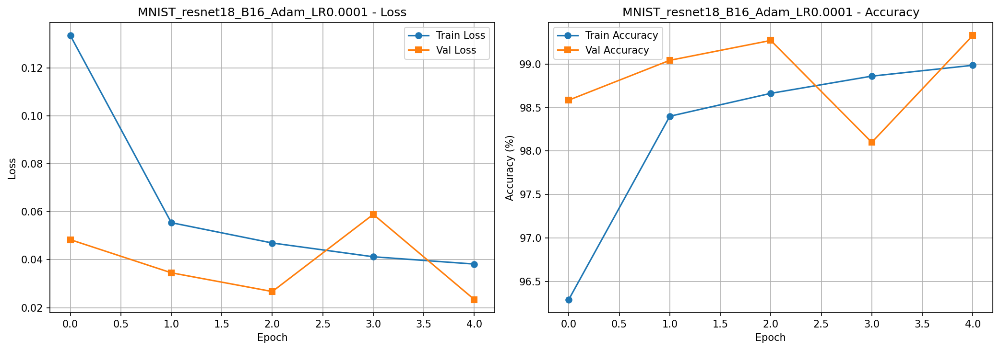 |
| ResNet-50, B16, SGD, LR=0.001 | 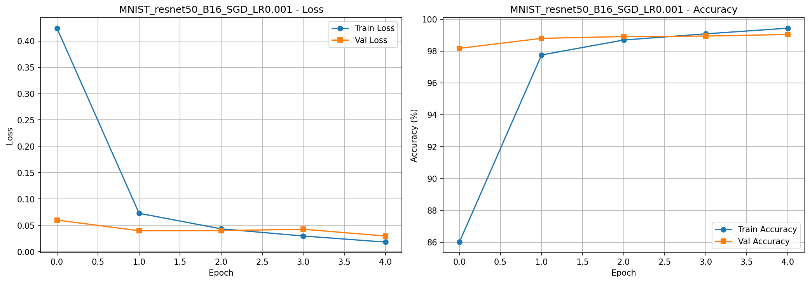 |

#### FashionMNIST Experiments
| Configuration | Training Curve |
|:-------------|:---------------|
| ResNet-18, B16, SGD, LR=0.001 | 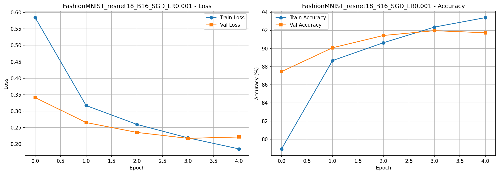 |
| ResNet-18, B16, Adam, LR=0.0001 | 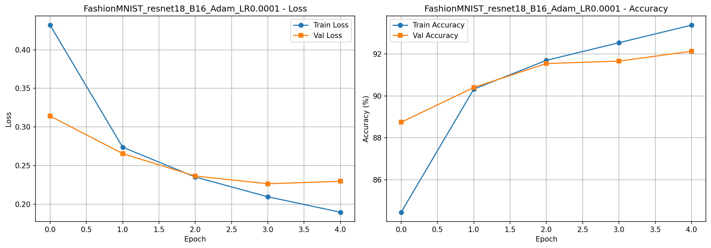 |
| ResNet-50, B16, Adam, LR=0.0001 | 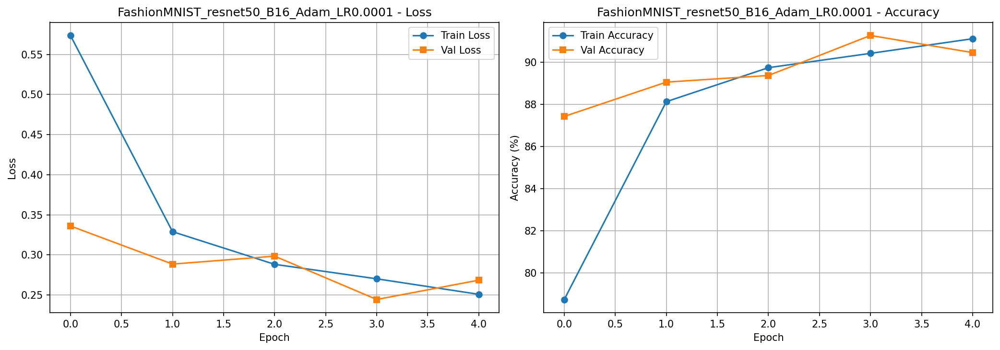 |

#### Q2 - CPU vs GPU Experiments
| Compute | Model | Optimizer | Training Curve |
|:--------|:------|:----------|:---------------|
| GPU | ResNet-18 | SGD | 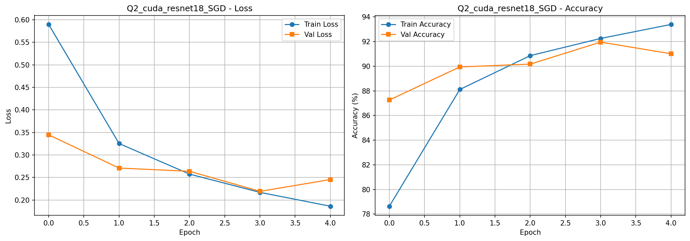 |
| GPU | ResNet-50 | SGD | 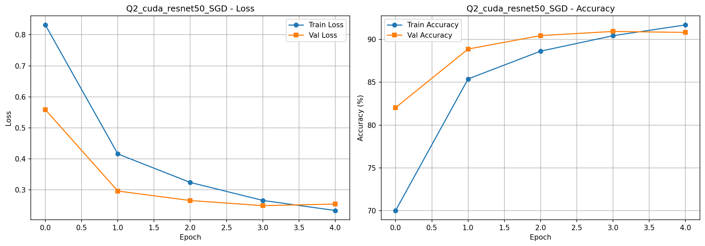 |
| CPU | ResNet-18 | SGD | 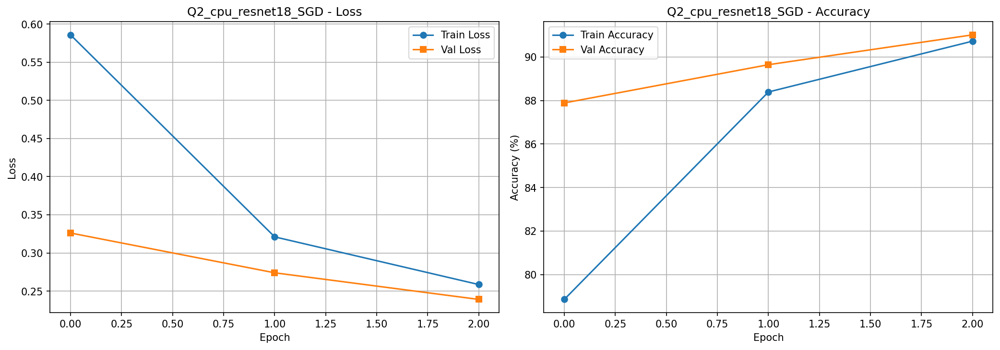 |
| CPU | ResNet-50 | SGD | 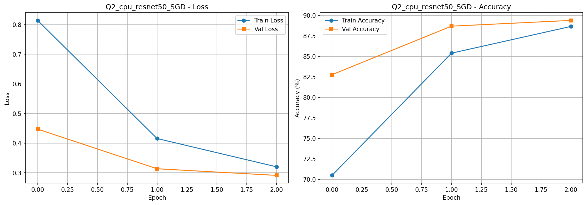 |

### SVM Analysis
| Visualization | Image |
|:-------------|:------|
| SVM Performance Analysis | 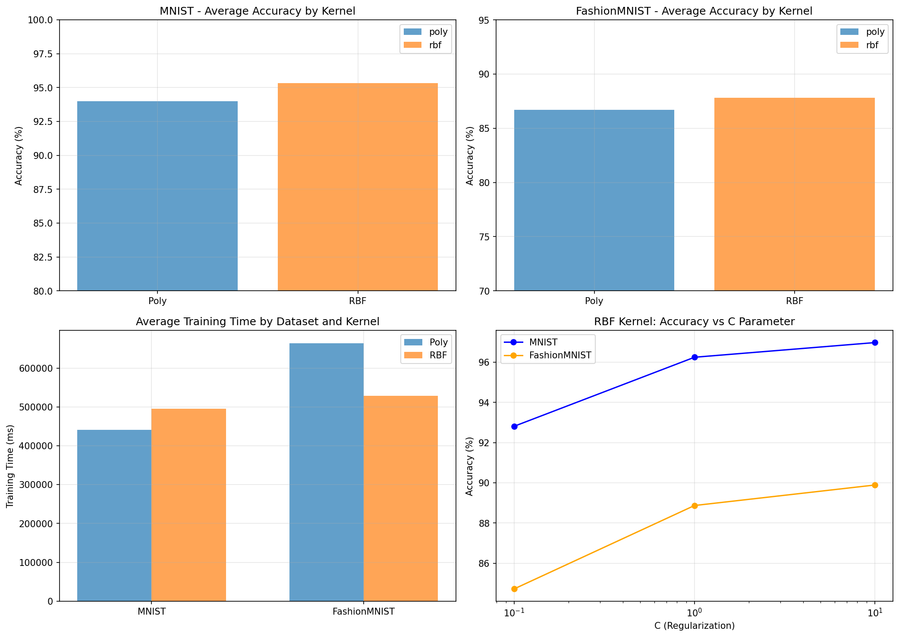 |
| Best SVM Confusion Matrix | 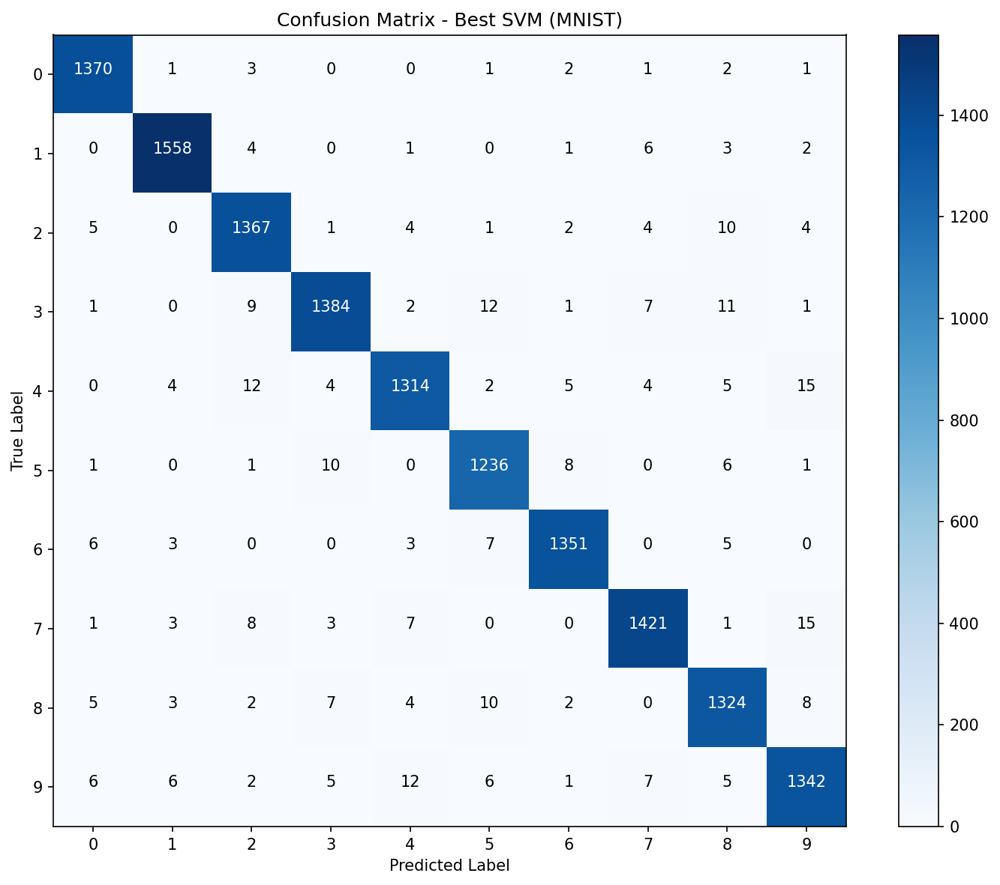 |

---

## Repository Structure

```
MLOps-NisargUpadhyay-B23CS1075/
├── README.md
├── MLOps_Assignment1_DeepLearning.ipynb
├── MLOps_Assignment1_SVM.ipynb
├── MLOps_Assignment1_DeepLearning/
│   ├── Q1a_Results.csv
│   ├── Q2_Results.csv
│   ├── best_model.pth
│   ├── Best_Model_Training_Curves.png
│   ├── MNIST_*.png (training curves)
│   ├── FashionMNIST_*.png (training curves)
│   └── Q2_*.png (CPU vs GPU training curves)
└── MLOps_Assignment1_SVM/
    ├── Q1b_SVM_Results.csv
    ├── Q1b_SVM_Analysis.png
    └── Q1b_Best_SVM_Confusion_Matrix.png
```

---
